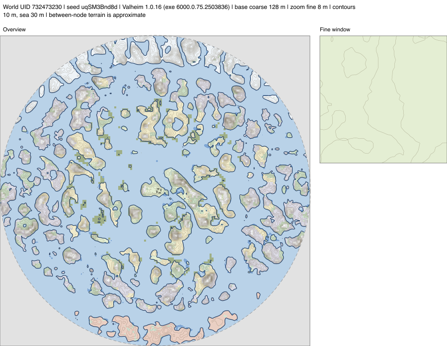

# Terrain maps from pinned dumps

`TerrainMapSvg` draws a terrain-only overview beside one fine window. It takes the same `WorldDumpLayerSpec` inputs as `LayeredDumpTerrain`, so every CSV is checked against its SHA-256, bounds, spacing, dump reply, world UID, seed, and game build **before** a pixel is drawn. Its zoom must fit completely within one layer finer than the designated base-height lattice. A malformed or mixed-world grid fails rather than filling a blank part of the map.



This example uses a native 128 m world dump and an 8 m dry Meadows window from the same disposable world. The image contains terrain only; it does not include roads, locations or player data.

```csharp
using System.Text.Json;
using Valheim.Testing;

static WorldDumpManifest Manifest(string file) =>
    JsonSerializer.Deserialize<WorldDumpManifest>(File.ReadAllText(file))
    ?? throw new InvalidDataException($"Empty dump manifest: {file}");

var coarse = new WorldDumpLayerSpec("coarse", "world-128.csv", Manifest("world-128.json"));
var fine = new WorldDumpLayerSpec("cave", "cave-8.csv", Manifest("cave-8.json"));
string svg = TerrainMapSvg.Render(
    new[] { coarse, fine }, baseHeightLayer: "coarse",
    overview: new TerrainArea(-10000, -10000, 9968, 9968), overviewMetresPerPixel: 32,
    zoom: new TerrainArea(112, -144, 368, 112), zoomMetresPerPixel: 1,
    contourInterval: 10);
File.WriteAllText("terrain-review.svg", svg);
```

The fine CSV must actually cover the example's zoom bounds; choose the site's coordinates from your own pinned dump. A full 128 m lattice runs from -10000 to 9968, so the overview stops at 9968 and uses a pixel size that divides its 19968 m extent. Its pixel centres must all have dump coverage. Capturing these inputs is described in [the dump contract](world-dump-contract.md). Their manifests must use the `cli_world` identity and `cli_world_dump` replies from the same pinned ValheimCLI session. A whole-world 128 m grid and a bounded 8 m window are typical, but the API accepts any verified layers that meet those coverage rules.

The palette, sea and river tints, 10 m contours, heavy 30 m waterline and world-disc mask follow the existing [ValheimCLI map example](https://github.com/tvongaza/valheimCLI/blob/b68949c/examples/world-map.py). This renderer uses sampled pixel-centre heights for its contour intersections, so line placement can differ slightly from that script's node-based marching squares. The SVG names both layers, their spacing, the build and world UID. The zoom box on the overview marks the detail's extent. Output is deterministic for identical files and arguments.

This is a picture for human inspection. Height between dump nodes is bilinear, biome edges use the nearest sample, and neither tells you how a loaded terrain collider or a player behaves. Use [terrain site snapshots](terrain-site-snapshots.md) for loaded ground and paint, and a native joined-client check for gameplay. Location labels, roads and arbitrary overlays belong to #202; this terrain view works without any location file.
